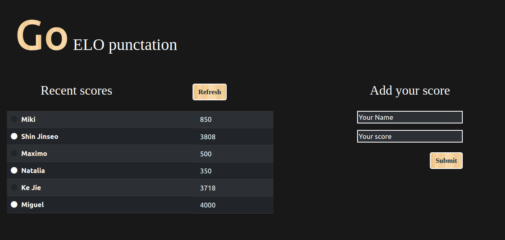

# Leaderboard

> This project display a leaderboard

## Desktop 💻

## Mobile 📱

## Live Demo
https://mike2611.github.io/leaderboard/

## Built with

- HTML
- CSS
- JavaScript
- Webpack

### Prerequisites

- Web browser
- Visual Studio Code

## Setup

To get a local copy up and running follow these simple example steps.

Open terminal
Clone this project by command git clone https://github.com/mike2611/leaderboard.git

- Download/Clone the repository files and navigate to root folder 
- Open terminal and move to the root folder
- Run npm start if you have npm installed or Open dist/index.html in the browser (you can use Live Server extension in Visual Studio Code)

## Authors

**👤 Miguel Angel Puentes**

- GitHub: [@mike2611](https://github.com/mike2611)
- Twitter: [@MiguelP2611](https://twitter.com/MiguelP2611)
- LinkedIn: [LinkedIn](https://linkedin.com/in/miguel-puentes-mata-90a562139/)

## 🤝 Contributing

Contributions, issues, and feature requests are welcome!

Feel free to check the [issues page](../../issues/).

## Show your support

Give a ⭐️ if you like this project!

## Acknowledgments

- [Microverse](https://www.microverse.org/)

